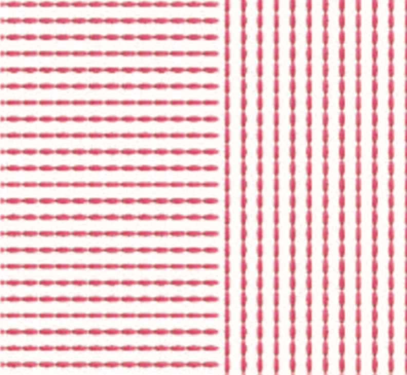
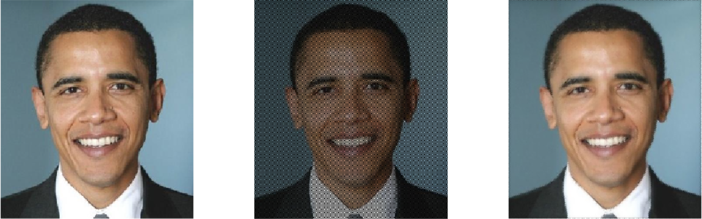

# Vector-Valued Image Regularization with PDEs

> This project implements vector-valued image regularization technique using PDE's as described in the paper - [Vector-Valued Image Regularization with PDEs: A Common Framework for Different Applications](https://tschumperle.users.greyc.fr/publications/tschumperle_pami05.pdf) by David Tschumperle and Rachid Deriche

A detailed report on methods and results can be found as [report.pdf](/docs/report.pdf). It was made as the final project for CS 663 - **Digital Image Processing** course in Autumn 2018 at Indian Institute of Technology (IIT) Bombay, India.

## Getting Started

These instructions will get you a copy of the project up and running on your local machine for development and testing purposes.

1. Run `/src/inpainting.m` file for image inpainting, `/src/denoising.m` file for image denoising and `/src/flowVisualisation.m` file for flow visualisation.
2. Replace the arguments of the functions with respective input image paths and set the hyperparameters you wish to use to generate the output images.
3. The tuned hyperparameters for our output images can be found in `/src/main.m` file.

## Results

### Image Inpainting


```
                Figure 1: Inpainting with 21x21 neighbourhood, t=5 and 10 iterations
```

```
                Figure 2: Inpainting with 10x10 neighbourhood, t=2 and 20 iterations
```

```
                Figure 3: Inpainting with 20x20 neighbourhood, t=3 and 20 iterations
```

### Image Denoising


```
Figure 4: From L to R : Noisy image, image filtered with gaussian smoothing with 5x5 kernel, image 
filtered with PDE regularisation with t=3, 3x3 neighbourhood and 5 iterations - better performance 
and lower noise especially on left and top parts of the image
```

```
Figure 5: From L to R :Noisy image, image filtered with PDE with t=3, 3x3 neighbourhood, 5 iterations
```


### Image Magnification


```
Figure 6: From L to R : Original Image. This image was downsampled by 4 to serve as input for the two
algorithms. Magnified image using bi-linear interpolation, magnified image using PDE regularisation
with t=3, 3x3 neighbourhood and 10 iterations.
```


### Flow Visualisation
   Original Image   |  Flow  |  Flow Visualisation
:-------------------------:|:-------------------------:|:-------------------------:
 | | 
 | | 

```
Figure 7: Input images, flow vectors and output images, with dt = 0.01, 100 iterations and sobel 
gradient vectors for Hessian Matrix. Paralallised code, runs much faster compared to others.
```

### Image Restoration


```
Figure 8: From L to R : Input Image, image with 50 % pixels removed in 2x2 granularity, output 
image with SSIM of 0.995, better than results with median filter. Also, median filter will 
become less accurate on increasing the box sizes.
```
   Image with pixels missing   |  Restored Image
:-------------------------:|:-------------------------:
 | 
```
Figure 9: from L to R : image with 50 % pixels removed and SSIM = 0.23, restored image with t=4, 
10 iterations with 3x3 neighbourhood, SSIM = 0.966 with original image.
```


## Authors

* **Saiteja Talluri** - [saiteja-talluri](https://github.com/saiteja-talluri)
* Shreyas Pimpalgaonkar - [shreyas-7](https://github.com/shreyas-7)
* Meet Kathiriya


## License

This project is licensed under the MIT License - see the [LICENSE](LICENSE) file for details.

